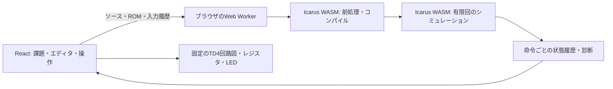

# 「Verilogで学ぶCPU自作入門」設計案

更新: 2026-09-19。Reactアプリの初期版を実装し、本番ビルドとChromeでの操作・Verilog実行を検証済み。起動手順は[README](../README.md)を参照。公開配信は未実施。

## 到達点

基本的なプログラミング経験があり、Verilogは初めての受講者が、60分でTD4の主要部品を実装し、自分の記述から動くCPUを観察する。「計算する回路」「値を保存する回路」「次の命令を選ぶ回路」の関係を説明できることを目指す。

TD4との命令互換性を第一候補とする。講義時間の調整は、雛形で提供するコード量と課題数で行う。

## 60分の進行

| 時間 | 内容 | Webでの操作 |
| --- | --- | --- |
| 0–10分 | CPU、論理回路、ビット幅、HDL、並行動作 | 加算器とレジスタの短い図解 |
| 10–20分 | 完成版TD4と最小限のVerilog文法 | 完成例を1命令ずつ進める |
| 20–28分 | 課題1: 加算器 | 足し算と桁上がりの式を実装 |
| 28–37分 | 課題2: レジスタ | 書き込み許可に応じた保存を実装 |
| 37–45分 | 課題3: PC | 次番地とジャンプ先の選択を実装 |
| 45–55分 | 自分のCPUでプログラムを実行 | レジスタ、PC、キャリー、LEDを観察 |
| 55–60分 | 振り返り、発展 | ROMの即値を変更、コードを持ち帰る |

最初に扱う構文は、`module`、`input/output`、`wire/reg`、`[3:0]`、`assign`、`always @(posedge clk ...)`、`if`、`<=`。必要な課題で順に説明する。`reg`という型名だけでレジスタになるわけではないこと、ノンブロッキング代入が同じクロック直前の値を参照することを図で補足する。

## 講義資料とハンズオン環境の役割

講義資料は全体像、回路の考え方、課題の目的、振り返りを担当する。ハンズオン環境は入力の操作、Verilogの編集、具体的な結果の確認、つまずきからの復帰を担当する。課題に必要な実装条件と構文の例はハンズオン内にも掲載する。

本編は約15ページを目安にし、各課題で「説明→予想→実装→動作確認→振り返り」を行う。講師ノートに時間配分、問いかけ、デモの操作手順、よくある質問、時間が足りない場合の進め方を記載する。

講義後の独学に使う補足ページを本編の後ろに追加する。本編の60分は補足を読まなくても完了する構成にし、補足では文法・回路・TD4の詳細、デバッグ、段階別ヒント、解答解説、発展課題、次の学習手順を扱う。各ページは講師の口頭説明なしで読める文章、図、期待結果を備える。

本編・課題から関連する補足ページへ、補足から対応する課題へ戻れるようにする。図、用語、命令例は共通の素材を使う。補足の学習順とページ案は[講義資料の構成案](lecture-plan.md)を参照。スライドへ転記する原稿は[本編](lecture-slides.md)と[補足・ヒント・解答](lecture-appendix.md)にまとめている。

## 画面と機能

### 1. 導入

講義のゴール、3つの回路の説明、Verilogの短い対比例、完成例への導線を表示する。初期表示時にエンジンを先読みし、準備完了または読込失敗・再試行を表示する。

### 2. ハンズオン

PCでの受講を主対象にする。上部に現在の課題と進捗、左に課題説明、中央にエディタ、右に課題の回路と入出力を置く。狭い画面は説明・コード・結果のタブに切り替える。

```text
導入 → 加算器 → レジスタ → PC → CPUを動かす
┌────────────┬────────────────┬─────────────┐
│ 何を作るか │ Verilog        │ 今作っている │
│ 実装条件   │ 編集範囲の強調 │ 回路と入出力 │
│ ヒント     │ [動作を確認]   │ 検証結果     │
└────────────┴────────────────┴─────────────┘
```

各課題は契約を固定した小さなモジュールにする。説明文に入出力と期待動作を明示し、全体の接続は提供する。初期コードは構文が通る仮の動作にして、初回から期待値との差を観察できるようにする。

| 課題 | 編集内容 | 動作確認 |
| --- | --- | --- |
| 加算器 | 5ビットに拡張した加算と桁上がり | `3+5=8`、`15+1=0, C=1`、全256組 |
| レジスタ | 許可時だけ`<=`で保存 | クロック前は保持、立ち上がりで更新、許可なしで保持、リセット |
| PC | ジャンプ許可時のロードと通常加算 | 通常加算、15→0、指定番地へのジャンプ、リセット |

エラーは「構文エラー」と「動くが期待した結果と違う」を分ける。後者は入力・期待値・実際の値を並べる。日本語の説明とエンジンの元の診断を確認できるようにする。

ヒントは考え方→注目する信号・使用する構文→空欄付きコードの骨組みの3段階とし、その先に解答・解説を置く。必要な段階を受講者が自由に選べるようにし、ヒントの利用は合否や進捗の評価に使わない。補足資料と同じ原稿を参照し、解答を適用する前のコードを残す。進捗とコードはブラウザ内に自動保存し、JSONの書き出し・読み込みも用意する。課題ごとの初期化には取り消しを用意する。

### 3. CPUを動かす

TD4の固定されたブロック図、16行のROM、レジスタ一覧、4個のLED、4個の入力スイッチを表示する。図はReact/SVGで描き、実際のVerilogの信号値を重ねる。

操作はリセット、1命令進む、1命令戻る、自動再生、停止、再生速度の変更。戻る操作は履歴の閲覧であることを明示する。

「実行した命令のPC」と「実行後の次のPC」を区別する。例えば`ADD A, 1`の表示に、Aの実行前後と次のPCを併記する。変化は色と数値の両方で示す。2進数を中心に10進数または16進数を補助表示する。

コード編集後は未反映と表示し、再コンパイルまで以前の実行結果と混同しないようにする。ソースまたはROMの反映でCPUをリセットする。入力スイッチは命令と命令の間で変更し、自動再生中なら一度停止する。

初期プログラム案:

| 番地 | 命令 | 機械語 | 観察すること |
| --- | --- | --- | --- |
| 0 | `ADD B, 1` | `0x51` | Bが増え、15の次は0になる |
| 1 | `OUT B` | `0x90` | LEDがBの値になる |
| 2 | `JMP 0` | `0xF0` | PCが0に戻る |

キャリーと条件分岐の説明には、別の短い`ADD`→`JNC`プログラムを使う。このLED例では`OUT`でキャリーが更新されるため、ADDのキャリーを後続のJNCへ保持する例には使わない。

ROM編集は命令選択と即値入力を基本にし、機械語を併記する。自由なアセンブリ言語のパーサ、波形ビューア、回路図の自動配置は初期版の必須機能にしない。

## TD4の仕様境界

4ビットA/B/PC/OUT、1ビットC、4ビット入力、8ビット×16語ROM。1回の有効クロック立ち上がりで1命令実行する。回路は加算器、入力選択、レジスタ、命令デコーダ、PCで構成する。

| 命令形式 | 8ビット符号 |
| --- | --- |
| ADD A, Im | `0000 iiii` |
| MOV A, B | `0001 0000` |
| IN A | `0010 0000` |
| MOV A, Im | `0011 iiii` |
| MOV B, A | `0100 0000` |
| ADD B, Im | `0101 iiii` |
| IN B | `0110 0000` |
| MOV B, Im | `0111 iiii` |
| OUT B | `1001 0000` |
| OUT Im | `1011 iiii` |
| JNC Im | `1110 iiii` |
| JMP Im | `1111 iiii` |

この表は[公開TD4実装の命令一覧](https://github.com/geodenx/td4)に基づく。検証は基本12命令形式を対象とし、未定義のオペコードや通常0にする下位ビットまで原著回路と完全一致することは未確認。公開教材で「完全互換」と表示する前に、原著『CPUの創りかた』の回路・真理値表と照合する。

画面のCは桁上がりありを1と定義する。各命令で加算器のキャリーを保存する。JNCは更新前のCで分岐する。非同期のアクティブLowリセットでA/B/OUT/PC/Cを0にする。ロジックICの電気的特性や伝搬遅延は扱わない。キャリー更新とリセットの参考は[公開ALU実装](https://github.com/geodenx/td4/blob/master/alu.v)。

## アプリと実行系の分担



Web Workerはブラウザのバックグラウンド処理であり、Cloudflare Workersとは別。Verilogの実行は受講者のブラウザ内で完結する。

React側は表示、教材、入力履歴、再生位置、保存を管理する。Workerは前処理、コンパイル、テストベンチによる駆動、結果の取得を担当する。CPUの実行結果は受講者のVerilogから得る。

テストベンチはアプリが生成し、ソース、ROM、入力履歴が同じなら同じ履歴を返す。初期案では256命令分を生成し、必要に応じて4096命令まで延長する。上限に到達したら表示して停止する。任意の途中状態を実行系へ書き戻すAPIは初期版では不要。

入力を時点Nで変更したら、Nより前の入力履歴を保持し、N以降の古い履歴を破棄してリセットから再実行する。途中へ戻ってから入力を変更した場合も同じ扱いにする。

状態履歴には、命令番号、実行前PC、実行した8ビット命令、実行前後のA/B/PC/OUT/C、入力値、必要な加算器・制御信号を含める。クロック立ち上がり直後のノンブロッキング代入が反映されてから記録する。X/Zは専用の値として保持し、0へ変換しない。

実行要求にIDとソース版を付け、古い要求の結果は採用しない。実行中の編集・中止・タイムアウト時はWorkerを終了して再生成できるようにする。有限のクロック数に加え、実時間・ログ量・波形サイズに上限を設ける。初期版は固定の状態トレースを表示に使い、VCDは検証・書き出し向けにする。

保存データには教材バージョン、課題別ソース、進捗、ROMを含める。起動時はCPUをリセットし、保存された表示位置をCPUの実際の状態として復元しない。

## 静的配信

React + TypeScript + Viteで構築し、JS/WASMを同一オリジンに配信する案。初期画面の導入を読んでいる間に実行系を準備する。実行時の外部CDN依存を避け、検証済みバージョンを固定する。

Cloudflare Pagesは`main`を本番ブランチ、`npm run build`をビルド、`dist`を出力先とする予定。GitHub連携による自動デプロイと将来の`cpu.uyuki.xyz`割り当てを想定する。[GitHub連携の公式説明](https://developers.cloudflare.com/pages/configuration/git-integration/github-integration/)

WASMの単一ファイルはPagesの25 MiB制限内である必要がある。今回のIcarus検証資産は最大約1.59 MiB。[Pagesの制限](https://developers.cloudflare.com/pages/platform/limits/)

## 初期版の実装状況

実装済み:

- 完成例・回路づくり・自分のCPUの3画面。
- 加算器・レジスタ・PCのVerilog編集、段階別ヒント、解答例、期待値比較、エラー行への移動。
- 受講者の3モジュールを提供済みデコーダ・配線へ接続し、Icarus WASMで実行。
- 命令単位の進行・巻き戻し・自動再生、PC・A・B・OUT・C、LED、前後の値、実行履歴、固定の回路概念図。
- ROM16語の編集、3つのサンプル、4ビットの入力スイッチと入力履歴の再計算。
- localStorage保存、JSONの読み込み・書き出し、置き換えの取り消し。
- 256〜4096命令の有限履歴、Workerの中止・タイムアウト、未確定値X/Zの表示。
- `npm run build`、ユニットテスト5件、Chromeでのブラウザテスト6件の成功。

残作業:

1. 実行系の対応ソースと移植パッチ、ビルド再現方法、公開時のソース提供方法を確定する。
2. 講義の通し練習を行い、文字サイズ・説明量・課題の時間配分を調整する。
3. Chrome以外の対象ブラウザとPagesプレビューで確認する。
4. GitHub連携・`main`の自動デプロイ・独自ドメインを設定する。

エンジン比較と実測結果は[技術検証メモ](technical-validation.md)を参照。
