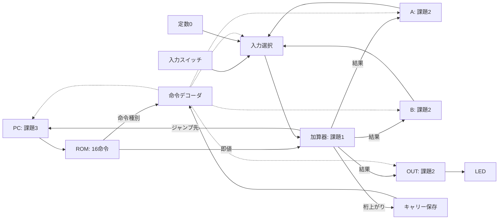

# Verilogで学ぶCPU自作入門 — 本編スライド原稿

対象: 基本的なプログラミング経験があり、Verilogは初めての人。
所要時間: ハンズオンを含めて60分。本編15枚。

これはGoogleスライドへ転記するための原稿です。「スライドに載せる内容」を画面へ、「講師ノート」を発表者ノートへ移してください。コードや表を大きく見せるためのページ分割は自由です。

**作成者向けメモ**: ハンズオンのWeb画面は設計段階です。本文中の操作名は実装予定のものです。講義前に実際の画面と対応させ、参加用URLを確定してください。課題の信号名はこの原稿内で統一しています。CPU全体の教材実装にも同じ名前を採用する想定です。

補足、段階別ヒント、完成コード、追加課題は[独学用の補足原稿](lecture-appendix.md)にあります。

## 進行表

| ページ | 時間 | 内容 |
| --- | --- | --- |
| S01–S02 | 0–2分 | ゴールと完成例 |
| S03–S06 | 2–10分 | CPU・HDL・4ビット・計算と保存 |
| S07–S09 | 10–20分 | Verilogの基本とTD4の全体像 |
| S10 | 20–28分 | 課題1: 加算器 |
| S11 | 28–37分 | 課題2: レジスタ |
| S12 | 37–45分 | 課題3: PC |
| S13–S14 | 45–55分 | 自分のCPUで命令を実行 |
| S15 | 55–60分 | 振り返りと独学への案内 |

---

<a id="s01"></a>

## S01 — Verilogで学ぶCPU自作入門

時間: 0–1分。

### スライドに載せる内容

**小さな回路を3つ作って、CPUを動かそう。**

- 作るもの: 4ビットCPU「TD4」を目指す回路
- 使うもの: ブラウザとVerilog
- 今日のゴール: 自分の回路で命令を実行し、LEDを動かす

### 図・配置

中央に「加算器」「レジスタ」「PC」の3つの箱。下にCPU全体図の小さなシルエットと4個のLEDを置く。タイトルよりも「自分の回路で動く」を印象づける。

### 講師ノート

「今日はCPUの主要な部品をVerilogで書きます。全体の配線や命令を解読する部分はこちらで用意しています。3つの部品を完成させると、自分が書いた回路でプログラムが動きます。」

Verilogを知らないことは前提にしていると伝える。半導体製造や現代の大規模CPUの全機能までは扱わず、小さなCPUの動作を理解する到達点を共有する。

---

<a id="s02"></a>

## S02 — 完成すると、こんな動きになる

時間: 1–2分。

### スライドに載せる内容

**数字を増やす → LEDへ出す → 最初へ戻る。**

```text
0: ADD B, 1
1: OUT B
2: JMP 0
```

```text
LED: 0001 → 0010 → 0011 → 0100 → …
```

この3命令を、自分で作ったCPUに実行させます。

### 図・配置

左に3命令、右に4個のLED。LEDの左端をビット3、右端をビット0として「8・4・2・1」を添える。

### 講師ノート・デモ

完成例を開いてリセットし、低速で自動再生する。ここでは命令を覚えてもらわず、「数字が増える」「3つの命令を繰り返す」の2点を指さす。30秒程度で止める。

「最後には、完成例の回路を自分のコードで置き換えます」と案内する。LEDが更新されるのはOUT命令のときで、すべての命令で光り方が変わるわけではない。

---

<a id="s03"></a>

## S03 — CPUは、値と次の行き先を更新する

時間: 2–4分。

### スライドに載せる内容

**命令を選び、必要な計算をして、結果を保存する。**

| 部品 | 仕事 |
| --- | --- |
| ROM | 実行する命令を置く |
| PC | 次に実行する命令の番地を覚える |
| 加算器 | 値を足す |
| レジスタ | 値を覚える |
| 命令デコーダ | 入力・保存先・次の番地の選び方を決める |

### 図・配置

「PC → ROM → 命令デコーダ」の流れと、「入力 → 加算器 → レジスタ」の流れを上下に置く。デコーダから後者へ制御の矢印を引く。

### 講師ノート

「PCはパソコンの略ではなく、プログラムカウンタです。たとえばPCが1なら、ROMの1番地の命令を使います。」

ソフトウェアの行番号に近いイメージから入る。ただし命令がPCを書き換えることで、繰り返しや分岐ができることも添える。

ここで示すのは動作の説明順。今回のTD4では、命令選択や計算を行う回路が動き、1回のクロック立ち上がりで状態が更新される。説明上の矢印1本につき1クロック必要だと受け取られないようにする。

---

<a id="s04"></a>

## S04 — Verilogと命令プログラムは、何を決める？

時間: 4–6分。

### スライドに載せる内容

**Verilogで回路を記述し、命令でその回路を動かす。**

| | Verilog | ROMの命令プログラム |
| --- | --- | --- |
| 決めること | 部品の動作と接続 | CPUに実行させる処理 |
| 例 | 2つの値を足す回路 | Bに1を足す命令 |
| 今日の操作 | 加算器などの一部を書く | 命令を実行し、即値を変える |

HDL = Hardware Description Language（ハードウェア記述言語）

### 図・配置

左の「Verilog」からCPUの箱へ矢印。右の「命令プログラム」からCPUにつながるROMへ矢印。矢印には「回路の動作を定義」「実行する命令を格納」と書く。

### 講師ノート

「ブラウザでは、Verilogに書いた回路の動きをシミュレーションします。加算器を間違えて書けば、その間違いもCPUの動きに現れます。」

「シミュレーション」と「合成して実機へ載せること」の違いは補足A16へ回す。今回ブラウザ内で物理的なCPUチップを製造しているわけではないことだけ明確にする。

---

<a id="s05"></a>

## S05 — 4ビットには、0〜15が入る

時間: 6–8分。

### スライドに載せる内容

**ビット幅は、値を入れる箱の大きさ。**

```text
ビットの重み: 8 4 2 1
         3 = 0 0 1 1
        15 = 1 1 1 1

             1111  (15)
           + 0001  ( 1)
           ------
           1 0000  (16)
           ↑ └──┘
       桁上がり 4ビットの結果
```

4ビットの結果は`0000`、桁上がりは`1`。

### 図・配置

筆算を大きく中央に置き、5ビット目を別の色で囲む。符号なしの4ビットとして扱っていることを小さく添える。

### 講師ノート・問いかけ

先に「15に1を足すと、4個のLEDはどうなるでしょう」と聞き、数秒待ってから答えを出す。桁上がりを捨てるのではなく、別の1ビットとして扱うことが次の課題につながる。

参照: [A01 数値とビット幅](lecture-appendix.md#a01)、[A08 加算と幅](lecture-appendix.md#a08)。

---

<a id="s06"></a>

## S06 — 計算する回路と、覚える回路

時間: 8–10分。

### スライドに載せる内容

**加算器が結果を作り、レジスタがタイミングを決めて保存する。**

```text
入力 → [ 加算器 ] → 計算結果 → [ レジスタ ] → 保存した値
                                  ↑
                                クロック
```

- 組み合わせ回路: 入力から結果が決まる
- 順序回路: 保存している状態も使う
- 今回のレジスタ: クロックが0→1になったときに値を取り込む

### 図・配置

計算結果と保存した値を別の吹き出しにする。「入力を変えた直後」と「クロック後」の2段階で図を見せる。

### 講師ノート・問いかけ

「加算器の入力を変えても、保存した値はまだ変わりません。次のクロックで、書き込みが許可されていれば取り込みます。」

実際の回路では信号の伝わる時間があるが、今回は安定した計算結果とクロックによる保存に注目する。リセットはクロックを待たずに働く例外として、課題2で説明する。

参照: [A03 回路の種類](lecture-appendix.md#a03)、[A07 クロックと保存](lecture-appendix.md#a07)。

---

<a id="s07"></a>

## S07 — Verilogは、小さな部品から読める

時間: 10–14分。

### スライドに載せる内容

**入力、出力、その関係を書く。**

```verilog
module and_gate (
  input  wire a,
  input  wire b,
  output wire y
);
  assign y = a & b;
endmodule
```

| 記述 | 意味 |
| --- | --- |
| `module` | 部品の定義 |
| `input` / `output` | 入力 / 出力 |
| `wire` | 信号をつなぐためのネット |
| `assign` | 信号間の関係を継続して表す |
| `&` | ビットごとのAND |

### 図・配置

左にコード、右に2入力ANDゲートと4行の真理値表。入力・出力を対応する色で示す。表が小さくなる場合は構文の意味を発表者ノートへ移す。

### 講師ノート・操作

ANDは両方1のときだけ1になると説明する。値が1ビットなら真理値表は`00→0, 01→0, 10→0, 11→1`。

「この`assign`は、一度だけ計算して終わる文ではありません。入力の変化に応じて、出力に関係を反映します。」

この時間にハンズオン環境を開いてもらい、エディタ・動作確認・ヒントの位置を案内する。WebでこのAND回路を編集する課題を追加する必要はなく、説明例として使う。

参照: [A02 論理ゲート](lecture-appendix.md#a02)、[A04 構文早見表](lecture-appendix.md#a04)。

---

<a id="s08"></a>

## S08 — クロックで、次の状態へ進む

時間: 14–17分。

### スライドに載せる内容

**クロック直前の値から、更新後の値を決める。**

```verilog
always @(posedge clk) begin
  q <= d;
end
```

- `posedge clk`: クロックが0から1になるタイミング
- `q <= d`: そのときの入力`d`を、保存先`q`の次の値にする
- クロック間は、`q`を保持する

別々の`assign`や`always`は、並行して動く回路を表せる。

### 図・配置

`d: 3→7`、クロックの立ち上がり、`q: 3→7`の3段のタイミング図。入力が先に変わり、保存値がクロックで変わることを矢印で示す。

### 講師ノート

このコードはモジュール内部の抜粋で、`q`は`reg`、`d`と`clk`は入力として宣言する。

「今回のクロックで値を保存する部分では、`<=`を使います。右辺の値を先に評価して、更新を予約します。」

Verilogにもブロック内の手続き的な実行順序があるため、「どの文もすべて順序がない」とは説明しない。`reg`宣言だけではレジスタになるとは限らない。詳しい比較は補足で扱う。

参照: [A05 記述と回路](lecture-appendix.md#a05)、[A06 代入と更新](lecture-appendix.md#a06)。

---

<a id="s09"></a>

## S09 — 今日のCPUの全体像

時間: 17–20分。

### スライドに載せる内容

**3つの部品を作り、用意された回路につなぐ。**

- 課題1: 加算器 — 値を計算する
- 課題2: レジスタ — A・B・OUTに値を保存する
- 課題3: PC — 次に実行する番地を覚える

ROM・入力選択・命令デコーダ・キャリー保存・全体の接続は用意済み。

### 図・配置

以下を描き直す。実線を値の流れ、点線を制御信号にする。課題の3種類だけ色を付ける。クロックとリセットの配線は省略し、図の下に共通入力として記載する。



### 講師ノート

同じレジスタ部品を3個使うことを説明する。「一度作った部品を、A・B・OUTに使い回せます。」

TD4は4ビットの値と4ビットの番地を扱い、ROMには8ビットの命令を16個置く。PC自身も状態を持つ回路で、通常のレジスタに次番地を選ぶ処理を加えたものとして説明する。

ハンズオンの進め方を再確認する。自分で予想してから動作を確認し、詰まったら段階別ヒントを使う。解答を使って先へ進んでもよい。

参照: [A09 命令表](lecture-appendix.md#a09)、[A10 データの流れ](lecture-appendix.md#a10)。

---

<a id="s10"></a>

## S10 — 課題1: 4ビットの加算器を作る

時間: 20–28分。説明2分、実装4分、確認と振り返り2分。

### スライドに載せる内容

**2つの入力を足して、結果と桁上がりを出そう。**

| 信号 | 幅 | 役割 |
| --- | --- | --- |
| `x`, `y` | 各4ビット | 足す値 |
| `result` | 4ビット | 結果の下位4ビット |
| `carry` | 1ビット | 桁上がり |

```verilog
module adder4 (
  input wire [3:0] x, y,
  output wire [3:0] result,
  output wire carry
);
  // TODO: この仮の動作を、加算する回路に置き換える
  assign {carry, result} = 5'b00000;
endmodule
```

確認: `3+5 → result=8, carry=0` / `15+1 → result=0, carry=1`

### 図・配置

加算器だけを拡大し、出力の4本と桁上がりの1本を分ける。コードは右側、確認例は下側。全体図の加算器にも小さく印を付ける。

### 講師ノート・操作

`[3:0]`は4ビット、`5'b00000`は5ビットの2進数定数、`{carry, result}`は左から信号を並べた5ビットのまとまりと説明する。

最初のコードは構文が通るが、常に0を出す仮の動作。まず動作確認を押し、期待値と実際の値の違いを見てもらう。修正後は桁上がりが必要な例も確認する。

振り返り: 「4ビットの結果に入りきらない1ビットにも、役割がありました。」

つまずき: `+`だけを書いても文にならない場合は、`assign`・左辺・`;`の位置を示す。幅の扱いで困っている人にはヒント2へ誘導する。

時間が不足したら、ヒント3または解答を適用して課題2へ進む。入力と出力の意味だけは全員で確認する。

参照: [課題1のヒント](lecture-appendix.md#hint-adder)、[課題1の解答](lecture-appendix.md#answer-adder)。

---

<a id="s11"></a>

## S11 — 課題2: 許可されたときに値を保存する

時間: 28–37分。説明2分、実装5分、確認と振り返り2分。

### スライドに載せる内容

**書き込み許可があるクロックで、入力を保存しよう。**

| 条件 | `q`の動作 |
| --- | --- |
| `reset_n=0` | クロックを待たず0に戻る |
| `reset_n=1`、立ち上がり、`load=1` | 入力`d`を保存する |
| それ以外 | 値を保持する |

```verilog
always @(posedge clk or negedge reset_n) begin
  if (!reset_n) begin
    q <= 4'b0000;
  end else if (load) begin
    // TODO: 入力を保存する処理に置き換える
    q <= 4'b0000;
  end
end
```

入力を変えるだけでは、保存した値は変わらない。

### 図・配置

左に入力`d`と保存値`q`、上に書き込み許可`load`、下にクロックとリセット。コードは宣言を省いたモジュール内部の抜粋として表示する。

### 講師ノート・操作

雛形では`clk/reset_n/load`は1ビット、`d`は4ビット入力、`q`は4ビットの`output reg`。末尾`_n`はこの教材で「0のとき有効」を表す命名規則で、Verilogが自動的に意味を付けるわけではない。

「リセットが最優先です。通常は、クロックが立ち上がり、書き込み許可があるときだけ保存します。」

確認順: リセット→`d=3, load=1`でクロック→`d=7`へ変更するがクロックなし→`load=0`でクロック→`load=1`でクロック。保存値の予想は`0,3,3,3,7`。

振り返り: 「A・B・OUTは、同じ作りのレジスタです。命令デコーダが、どこへ書くかを選びます。」

つまずき: 許可がないときに0を代入してしまう例を取り上げる。今回のクロックで駆動するレジスタでは、代入を行わないと保持される。組み合わせ回路で代入を省く話とは区別する。

参照: [課題2のヒント](lecture-appendix.md#hint-register)、[課題2の解答](lecture-appendix.md#answer-register)。

---

<a id="s12"></a>

## S12 — 課題3: 次に実行する番地を決める

時間: 37–45分。説明2分、実装4分、確認と振り返り2分。

### スライドに載せる内容

**普通は次へ。ジャンプするときは指定の番地へ。**

| 条件 | クロック後のPC |
| --- | --- |
| リセット | 0 |
| `jump=1` | `target` |
| `jump=0` | 今のPC+1 |

```verilog
always @(posedge clk or negedge reset_n) begin
  if (!reset_n) begin
    pc <= 4'b0000;
  end else begin
    // TODO: 次の番地を選ぶ処理に置き換える
    pc <= pc;
  end
end
```

PCも4ビット。通常の進行では、15番地の次は0番地。

### 図・配置

PCから「+1」と「target」の2方向を選択器へ入れ、選ばれた値をPCへ戻す図。ROMの現在行とジャンプ先を小さく添える。

### 講師ノート・操作

雛形では`jump`は1ビット入力、`target`は4ビット入力、`pc`は4ビットの`output reg`。

ジャンプするかどうかは提供される命令デコーダが決める。受講者が作るのは、確定した`jump`を使って番地を選び、クロックで保存する部分。

確認順: リセット→通常進行で1→`jump=1, target=9`で9→通常進行で10。追加確認として15→0を試す。

振り返り: 「PCを変更できるので、同じ命令を繰り返したり、別の場所へ進んだりできます。」

つまずき: ジャンプ時にも`+1`を加えてしまうと、指定した番地を飛ばす。ジャンプ先と通常加算は別の選択肢だと図で戻る。

参照: [課題3のヒント](lecture-appendix.md#hint-pc)、[課題3の解答](lecture-appendix.md#answer-pc)。

---

<a id="s13"></a>

## S13 — 自分のCPUで、LEDを数え上げる

時間: 45–51分。

### スライドに載せる内容

**書いた回路をつなぎ、命令を1つずつ実行する。**

| 番地 | 命令 | 機械語 |
| --- | --- | --- |
| 0 | `ADD B, 1` | `0x51` |
| 1 | `OUT B` | `0x90` |
| 2 | `JMP 0` | `0xF0` |

リセット直後は`PC=0, B=0, OUT=0`。

| 実行した番地 | 命令 | 実行後B | 実行後OUT | 次のPC |
| --- | --- | --- | --- | --- |
| 0 | ADD B, 1 | 1 | 0 | 1 |
| 1 | OUT B | 1 | 1 | 2 |
| 2 | JMP 0 | 1 | 1 | 0 |
| 0 | ADD B, 1 | 2 | 1 | 1 |
| 1 | OUT B | 2 | 2 | 2 |

### 図・配置

ハンズオン画面と同じ位置関係で、ROM、B、OUT、LEDを置く。表は段階表示にし、次の行を予想してから見せる。

### 講師ノート・操作

1. 3課題のコードをCPUへ反映し、実行画面でリセットする。
2. 命令を1つずつ進め、上の表と比較する。
3. ADDで使われる加算器とBレジスタを指す。
4. OUTでBは変わらず、OUTレジスタが更新されることを指す。
5. JMPでPCが0になることを指す。
6. 低速の自動再生を試し、余裕があれば増分を1から3へ変える。

「計算結果とLEDの値は、必ず同時に変わるわけではありません。LEDはOUTレジスタにつながっています。」

うまく動かない場合は、最初に期待と違った命令まで戻って観察する。コードが実行側に反映済みか、ROMとリセット状態が合っているかも確認する。

---

<a id="s14"></a>

## S14 — 計算結果によって、次の番地を変える

時間: 51–55分。

### スライドに載せる内容

**JNCは、保存されているキャリーが0ならジャンプする。**

```text
0: MOV A, 14
1: ADD A, 1
2: JNC 1
3: OUT 15
4: JMP 4
```

| 実行命令 | 実行後A | 実行後C | 次のPC |
| --- | --- | --- | --- |
| MOV A, 14 | 14 | 0 | 1 |
| ADD A, 1 | 15 | 0 | 2 |
| JNC 1 | 15 | 0 | 1 |
| ADD A, 1 | 0 | 1 | 2 |
| JNC 1 | 0 | 0 | 3 |

最後のJNCは、**実行前のC=1**を見てジャンプしない。

### 図・配置

PCの1→2→1のループと、2→3へ抜ける矢印を描く。最後のJNCの行に「判定に使ったC=1」「更新後C=0」の2つのラベルを付ける。

### 講師ノート・操作

ROMを切り替えてリセットし、表の5命令を進める。その後OUTで全LEDが点灯することを確認する。機械語は`3E 01 E1 BF F4`。

この教材ではC=1を桁上がりありとして表示する。TD4ではADD以外の命令でも加算器の結果からCが更新される。JNCは更新前のCで判定し、正規のJNC命令では実行後のCは0になる。

`JMP 4`は停止命令ではなく、同じ番地へジャンプし続ける命令。クロックと命令実行は続くが、この例のLEDの値は変わらない。

残り時間が少なければ、このページは講師の実演にする。補足A11で同じ表を後から追えるようにしておく。

参照: [A11 キャリーと分岐](lecture-appendix.md#a11)。

---

<a id="s15"></a>

## S15 — 作った3つの部品が、命令を動かしている

時間: 55–60分。

### スライドに載せる内容

**CPUは、小さな回路をつなぎ、状態を更新することで動く。**

| 作ったもの | CPUの中での仕事 |
| --- | --- |
| 加算器 | 命令に必要な値を計算する |
| レジスタ | A・B・OUTに値を保存する |
| PC | 次に実行する命令の番地を覚える |

振り返り:

1. 入力を変えただけで、レジスタの値は変わる？
2. ADDの直後に、LEDも変わる？
3. 同じ命令を繰り返せるのは、どの部品のおかげ？

この先は、補足・ヒント・追加課題で続きを試そう。

### 図・配置

S09と同じ全体図で、作った3種類の部品をもう一度強調する。下部に資料URLとハンズオンURLを配置する。URL確定後にQRコードも作成する。

### 講師ノート

回答は「リセット等を除き、保存のタイミングまで変わらない」「OUT命令が出力を更新する」「PCと、それを制御する命令デコーダ」。隣の人への説明、または自分の言葉で一文にする時間を取る。

「今回作った部分が、目の前の命令実行につながっています。次は、入力を使うプログラムや、命令を選ぶ回路にも挑戦できます。」

コードを保存・書き出しする手順を案内する。ヒントや解答を使った人には、後日もう一度書いてみる練習を勧める。

補足への入口:

- 基礎を復習する: [A01](lecture-appendix.md#a01) → [A03](lecture-appendix.md#a03) → [A07](lecture-appendix.md#a07)
- 書き方を確認する: [A04](lecture-appendix.md#a04) → [A06](lecture-appendix.md#a06) → [A14](lecture-appendix.md#a14)
- CPUの中を追う: [A09](lecture-appendix.md#a09) → [A10](lecture-appendix.md#a10) → [A11](lecture-appendix.md#a11)
- 自分で続きを試す: [A15](lecture-appendix.md#a15) → [A16](lecture-appendix.md#a16)

---

## 講義前の準備メモ

- 本編と補足の図・信号名・課題コードをハンズオン環境にそろえる。
- 完成例、課題の初期状態、自分のコードで完成させた状態の切り替えを確認する。
- LEDカウンタとJNCのROMを用意し、リセットから表のとおりに進むか確認する。
- 参加用URL、資料URL、利用ブラウザ、保存・再開方法を確定する。
- 自動再生の速度と文字サイズを投影環境で確認する。
- 接続や操作に詰まった受講者には、まず講師の画面で予想と観察に参加してもらう。
- 時間が足りない場合も、3部品と命令実行の対応、最後の振り返りは残す。

## 内容の出典と範囲

TD4は渡波郁『CPUの創りかた』で紹介されるCPUを題材にしている。[出版社の書籍案内](https://book.mynavi.jp/ec/products/detail/id=22065)

命令表と状態更新の確認には[公開TD4実装](https://github.com/geodenx/td4)および本リポジトリの技術検証を参照した。図と説明はこの教材用に作成している。未定義符号を含む原著回路との完全一致を確認した資料ではない。詳細は[技術検証メモ](technical-validation.md)。
